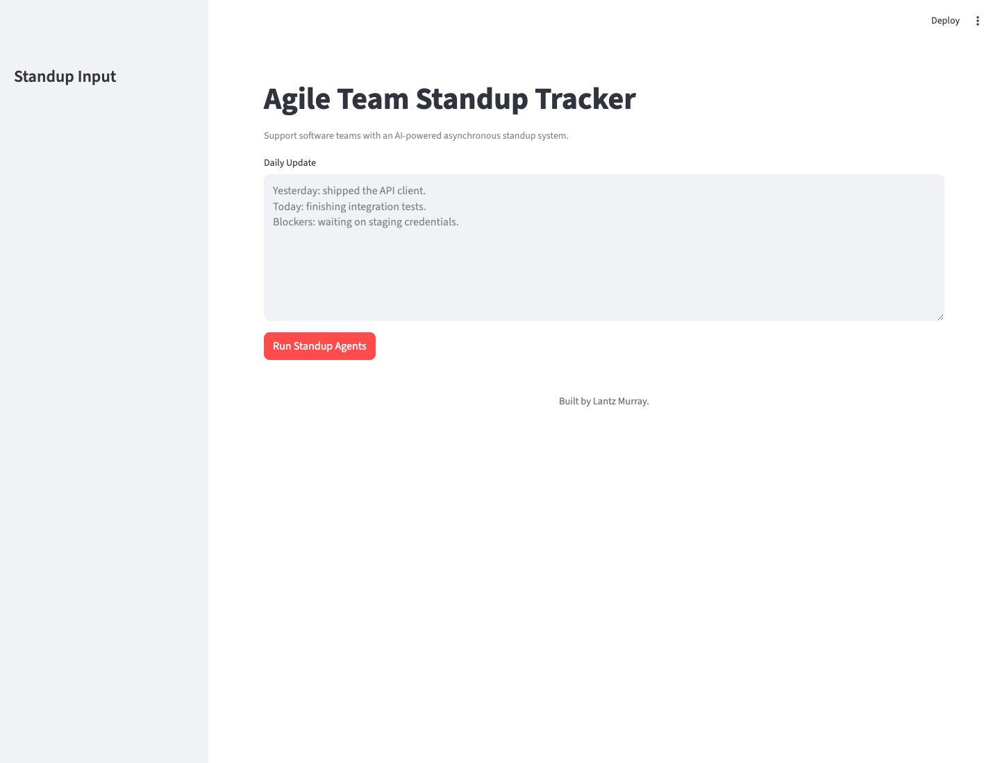

# Agile Team Standup Tracker

A multi-agent system that supports software teams with an AI-powered asynchronous standup system using local LLM models.

## Screenshot



## Features

- **Multi-Agent Architecture**: Three specialized agents work together to provide comprehensive standup assistance
- **Local LLM Integration**: Uses Ollama with LLaMA 2 and other local models for privacy and cost-effectiveness
- **Persistent Memory Storage**: TinyDB-based memory system for tracking standup sessions and agent interactions
- **Interactive Frontend**: Streamlit-based web interface for easy standup management
- **Self-Contained**: All code and dependencies included in this project - no external shared folder dependencies

## Agents

### 1. Summary Agent
- Summarizes team updates from multiple team members
- Identifies key themes and patterns
- Highlights important announcements
- Creates executive summaries for stakeholders

### 2. Blocker Detector Agent
- Detects blockers and impediments from team updates
- Categorizes blockers by type and severity
- Suggests potential solutions
- Tracks blocker resolution status

### 3. Sprint Progress Estimator Agent
- Estimates sprint progress based on team updates
- Identifies at-risk items
- Provides velocity metrics
- Suggests course corrections

## Installation

1. **Navigate to the project directory**:
```bash
cd SchoolOfAI/Official/soai-22-agilestandup
```

2. **Install Python dependencies**:
```bash
pip install -r requirements.txt
```

3. **Install Ollama** (if not already installed):
```bash
# Visit https://ollama.ai for installation instructions
# Pull the LLaMA 2 model
ollama pull llama2
```

4. **Start Ollama** (if not already running):
```bash
ollama serve
```

## Usage

### Start the Application

Run the Streamlit frontend:

```bash
streamlit run frontend/app.py
```

The application will open in your browser at `http://localhost:8501`

### Using the Application

1. **Enter Daily Update**: Provide your standup update in the sidebar
2. **Click "Run Standup Agents"**: The agents will analyze and provide insights
3. **Review Results**: View agent outputs and recommendations
4. **Inspect the Collaboration Log**: See the ordered session history for the run

### Project Structure

```
soai-22-agilestandup/
├── README.md                 # This file
├── requirements.txt           # Python dependencies
├── PROJECT_22_GUIDE.md      # Project guide
├── orchestrator.py           # Agent orchestration
├── agents/                  # Agent implementations
│   ├── base.py            # Runtime bridge and utilities
│   ├── summary_agent.py
│   ├── blocker_detector_agent.py
│   └── sprint_progress_estimator_agent.py
├── frontend/                # Streamlit UI
│   ├── app.py             # Main application
│   └── components.py       # Reusable UI components
├── runtime/                 # Self-contained runtime
│   ├── __init__.py
│   ├── config.py          # Configuration management
│   ├── llm_client.py      # LLM client interface
│   └── project_runtime.py # Core runtime logic
└── memory/                  # Persistent storage
    └── memory_store.json  # Session data (auto-created)
```

## Configuration

### Environment Variables (Optional)

Create a `.env` file in the project root to customize behavior:

```bash
# LLM Configuration
LLM_PROVIDER=ollama
LLM_MODEL=llama2
LLM_ENDPOINT=http://localhost:11434/api/generate
LLM_REQUEST_TIMEOUT_SECONDS=1800

# AWS Configuration (for Bedrock)
AWS_REGION=us-east-1
AWS_ACCESS_KEY=your_access_key
AWS_SECRET_KEY=your_secret_key

# OpenAI Configuration (optional)
OPENAI_API_KEY=your_openai_api_key
```

### Model Selection

The system supports multiple LLM models:
- `llama2` (default) - Good balance of performance and resource usage
- `mistral` - Faster inference, good for quick iterations
- `codellama` - Specialized for technical standups and code-related analysis

## Data Storage

### Memory Store

Standup sessions and agent interactions are stored in:
- `memory/memory_store.json` - TinyDB database with session history

This file is automatically created when you first run the application.

## Troubleshooting

### Common Issues

1. **Ollama Connection Error**
   - Ensure Ollama is installed and running: `ollama serve`
   - Check if the model is pulled: `ollama pull llama2`
   - Verify Ollama is accessible at `http://localhost:11434`

2. **Import Errors**
   - Ensure you're running from the project directory
   - Install all dependencies: `pip install -r requirements.txt`
   - This project is self-contained - no external shared folder dependencies

3. **Memory Database Issues**
   - Ensure the `memory/` directory exists
   - Check file permissions for `memory/memory_store.json`
   - Delete `memory/memory_store.json` to reset (optional)

### Performance Optimization

- Use appropriate model sizes based on available hardware
- Consider using `mistral` for faster iterations during development
- Monitor memory usage with large standup sessions
- Clear old sessions from memory to improve performance

## Development

### Adding New Agents

1. Create a new agent file in the `agents/` directory
2. Import the agent in `orchestrator.py`
3. Add the agent to the workflow in the `run_workflow` method

### Customizing the Frontend

The frontend uses Streamlit components from `frontend/components.py`. You can:
- Modify `frontend/app.py` to change the UI layout
- Add new components in `frontend/components.py`
- Customize styling and user interactions

## License

This project is part of the School of AI curriculum and follows the same licensing terms.

## Support

For issues and questions:
- Check the troubleshooting section
- Review the project structure and code
- Ensure Ollama is properly installed and running
